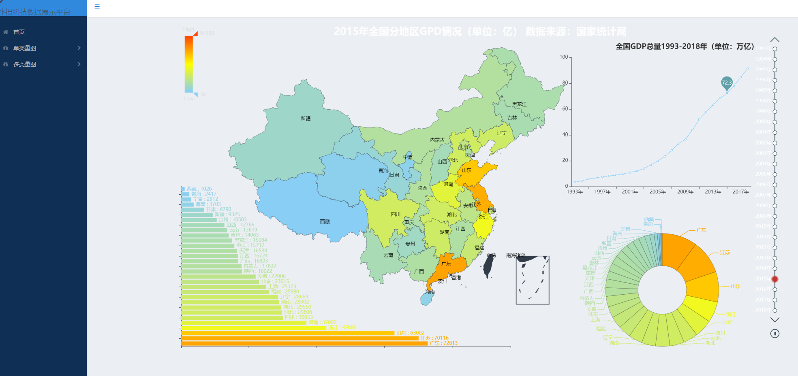
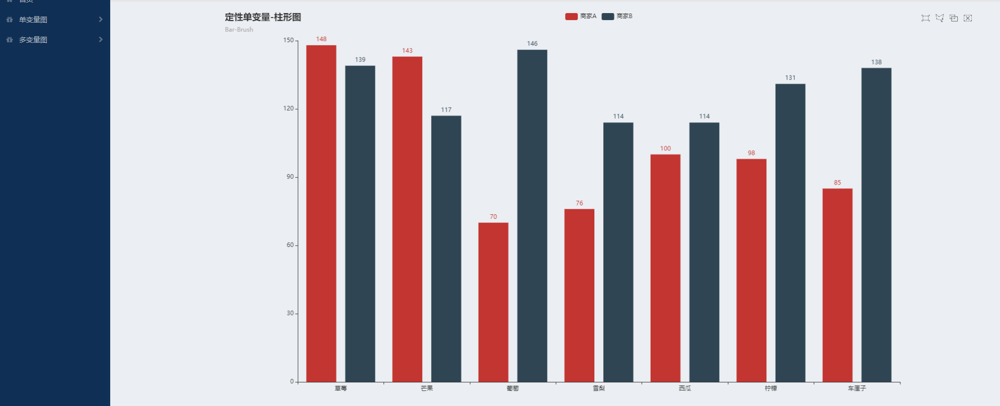
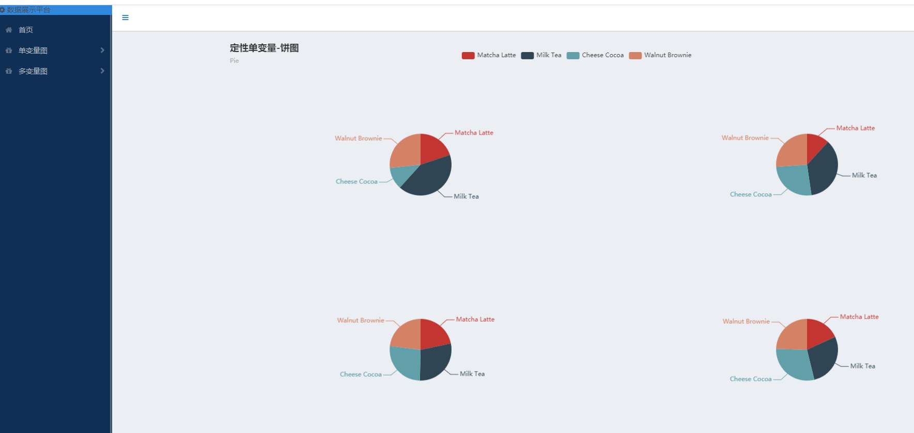
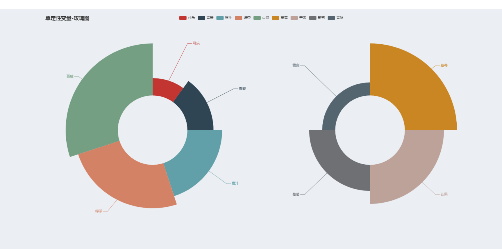
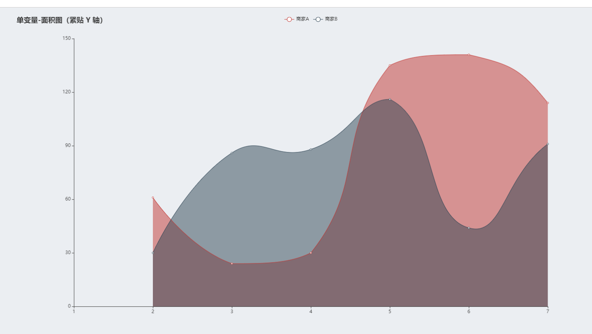
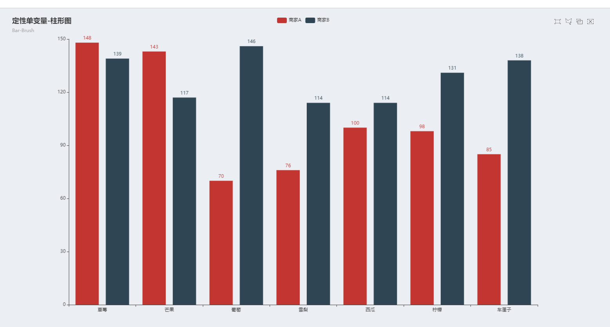
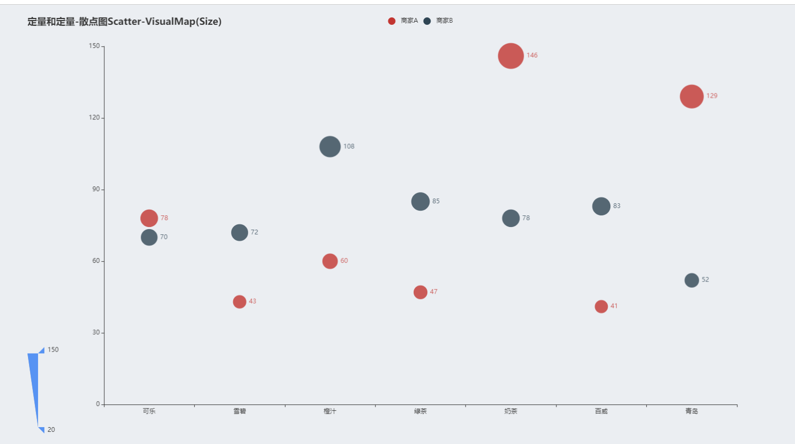
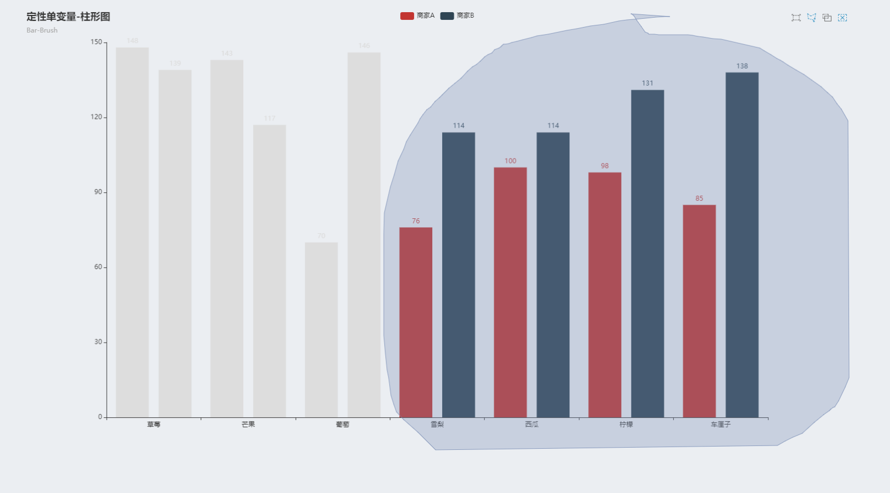

# 基于Python + Flask + PyEcharts +plotly的自动数据可视化平台。 

## 该项目有三个目的：
> 1.指导数据分析初学者学习基本的pyecharts绘图，并展示到Flask开发的web平台上。 
> 
> 2.根据数据的变量类型和逻辑，指导数据分析初学者绘制该数据对应的图（如单定量-直方图） 
> 
> 3.根据用户上传数据变量的性质，单变量还是双变量，定性变量还是定量变量，自动进行数据可视化。

Automatic data visualization platform based on Python + flask + pyecharts + plot.


## The project has three purposes:

> 1. Guide beginners of data analysis to learn the basic pyechards drawing and display it on the web platform developed by flask.
>
> 2. According to the variable type and logic of the data, guide beginners of data analysis to draw the corresponding graph of the data (such as single quantitative histogram)
>
> 3. According to the nature of the data variable uploaded by the user, single variable or double variable, qualitative variable or quantitative variable, data visualization is automatically carried out.


# 依赖库
| Dependency | Version |
| ------ |------|
| Python | 3.8.8 |
| flask | 1.1.1 |
| pyecharts | 1.7.1 |
| requests | 2.22 |


# 使用
```
python run.py
# 在浏览器中访问http://localhost:776
```
# 前端展示




定性单变量的柱形图、饼图、玫瑰图，定量变量的直方图和面积图。


多变量定性和定量变量的箱线图，定量和定量的散点图，定性和定性变量的折线图。用于指导数据分析初学者学习基本的pyecharts绘图，并展示到Flask开发的web平台上。















参考的网站博客:

pyecharts 中文文档

https://gallery.pyecharts.org/#/Candlestick/professional_kline_chart
